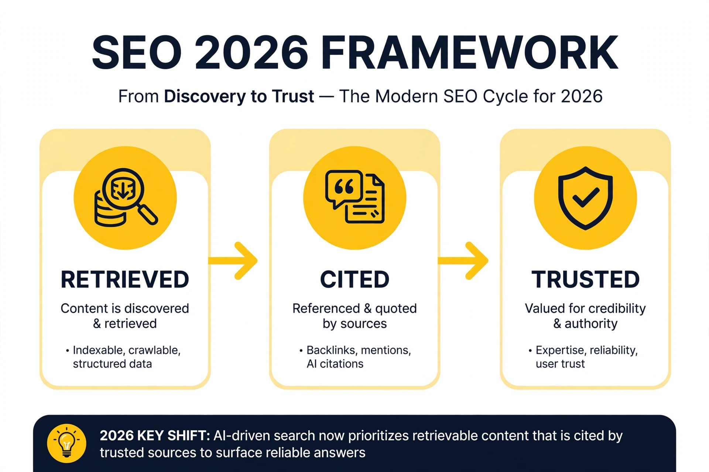
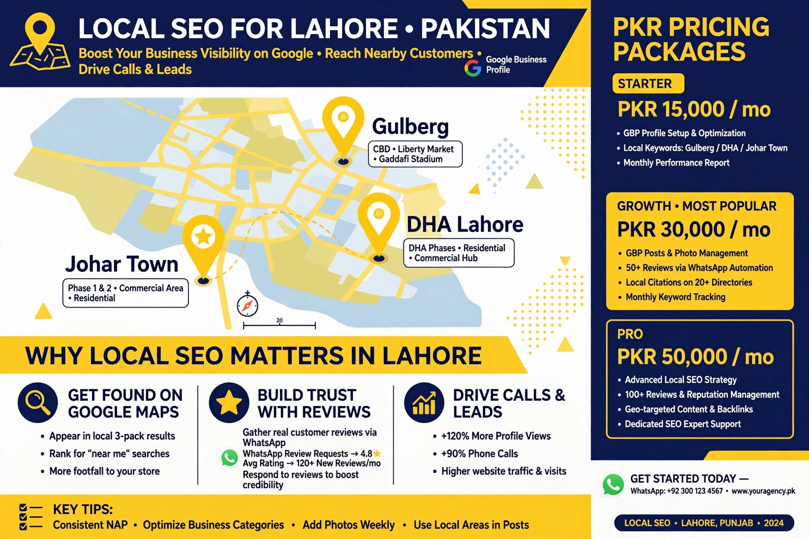

<!DOCTYPE html>
<html lang="en">
<head>
<meta charset="UTF-8">
<meta name="viewport" content="width=device-width, initial-scale=1">
<title>SEO in 2026: The Complete Guide to SEO, Strategies, Benefits and Real Growth | Bukhari SEO</title>
<meta name="description" content="A complete guide to SEO in 2026, including SEO strategies, benefits, practical growth methods and insights from Bukhari SEO. With images.">
<link rel="canonical" href="https://blog.bukhariseo.pk/post/seo-in-2026/">

</head>
<body>

FEATURED GUIDE • Updated Sep 2026 • With Images

<h1>SEO in 2026: How to Get Cited by AI, Rank in Google & Grow in Pakistan</h1>

<b>TL;DR: Old SEO = Rank → Click. New SEO in 2026 = Retrieved → Cited → Trusted. Goal is to get cited inside Google AI Overviews, even if zero-click.</b>

60% of searches now end without click (SparkToro 2026). 48% queries show AI Overviews. 76% of AI citations come from top 10 pages.

<h2>01 - The Old SEO is Dead</h2>

In May 2024 Google flipped the switch. By late 2025, AI Overviews were on almost half of all queries. The classic 10 blue links still exist, but most users never scroll past the generative answer.

<b>OLD MODEL:</b> Query → Rank top 3 → Get click → Convert <b>2026 MODEL:</b> Query → AI retrieves → AI cites → User trusts → Action

<h2>02 - New Framework: Retrieved → Cited → Trusted</h2>

Stanford HAI + SEO platforms 2026 converged on 3-stage pipeline.

<b>RETRIEVED</b> Can AI find & parse you? <code>&lt;200ms TTFB, fresh &lt;90d</code>

<b>CITED</b> Does AI use you in answer? <code>Tables, lists, FAQs</code>

<b>TRUSTED</b> Does AI believe you? <code>E-E-A-T, Reddit/YT mentions</code>

Data: Pages with schema FAQ + HowTo + Table are 2.3x more likely to be cited vs plain paragraphs (Authoritas Jan 2026).

<h2>03 - Stage 1: How to Get Retrieved</h2>
<ul>
<li><b>Speed &lt;200ms TTFB:</b> Move to edge CDN, LCP &lt;1.2s</li>
<li><b>Metadata Relevance:</b> Title = Query intent + entity. Include 2026 + number.</li>
<li><b>Fresh &lt;3 Months:</b> Add "What changed in Sep 2026" box at top.</li>
</ul>

<h2>04 - Stage 2: How to Get Cited by AI</h2>

Citation is won with structure, not prose.

<ol>
<li><b>Tables beat paragraphs</b> - Create Old vs New, Cost in PKR, Tool comparison tables</li>
<li><b>List → Answer → Proof</b> - Start with takeaways</li>
<li><b>FAQ from real questions</b> - Pull from PAA, Reddit r/SEO, YouTube comments, answer in &lt;45 words</li>
<li><b>Fact density &gt;1 per 100 words</b> - Every 2-3 sentences have date, %, PKR price</li>
</ol>

<h2>05 - Stage 3: How to Get Trusted (E-E-A-T)</h2>
<ul>
<li><b>Experience:</b> Show screenshots from Search Console, GBP, actual Lahore client results</li>
<li><b>Expertise:</b> Author bio 10+ years, link to bukhariseo.pk, certifications</li>
<li><b>Authoritativeness:</b> Get mentioned on Reddit, local Lahore directories, YouTube</li>
<li><b>Trust:</b> Physical address Lahore, phone 0315 3878279, WhatsApp verified</li>
</ul>

<h2>06 - What Still Works for Pakistan & Lahore</h2>

Local SEO is your unfair advantage. While informational queries are eaten by AI, "near me" + transactional still shows Map Pack.

<ol>
<li><b>Google Business Profile:</b> Complete every field. Add services with keywords "SEO Services in Lahore". Post weekly.</li>
<li><b>NAP Consistency:</b> Name-Address-Phone must match exactly on website footer, Facebook, LinkedIn, Hamariweb.</li>
<li><b>WhatsApp Reviews:</b> Pakistan customers prefer WhatsApp. Ask for Google review + WhatsApp testimonial.</li>
<li><b>Mixed Language Content:</b> Target "SEO Lahore price", "best SEO company in Pakistan cost" - include PKR pricing tables.</li>
</ol>

Result from Lahore clients: GBP-optimized + WhatsApp review flow increased calls by 34% even when organic clicks dropped 18% due to AI Overviews.

<h2>07 - 30-Day Action Plan</h2>

<b>WEEK 1 - Retrieval</b> 
✓ Audit TTFB &lt;200ms, LCP &lt;1.2s 
✓ Update title/meta with 2026 + entity 
✓ Add last-updated badge  
<b>WEEK 2 - Citation</b> 
✓ Add 1 comparison table + 3 FAQs 
✓ Increase fact density (numbers, PKR) 
✓ Add TL;DR list at top  
<b>WEEK 3 - Trust</b> 
✓ Add author box + how we tested + screenshots 
✓ Publish GBP post + get 3 reviews 
✓ Create 1 YouTube short  
<b>WEEK 4 - Amplify</b> 
✓ Share on Reddit r/SEO + LinkedIn 
✓ Internal link from 3 old posts 
✓ Submit to GSC

<h3 style="color:#facc15;margin-top:0">Need help growing your website? Talk to Bukhari SEO</h3>

Based in Lahore, working across Pakistan. Practical SEO, not marketing fluff.

Email: zshabbirbukhari@gmail.com | Call 0315 3878279 | WhatsApp

<a href="https://blog.bukhariseo.pk" style="color:#facc15">← Back to blog.bukhariseo.pk</a>

</body>
</html>

