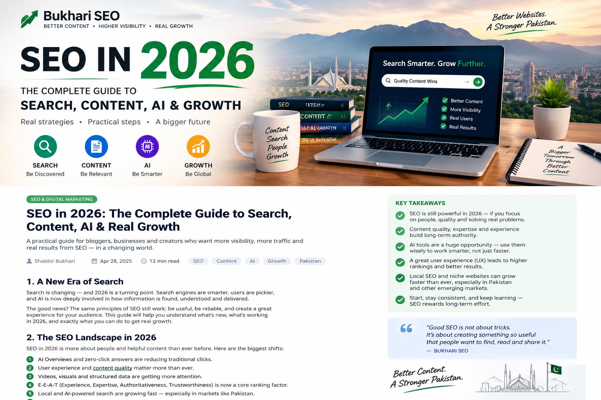

# SEO in 2026: The Complete Guide to SEO, Strategies, Benefits and Real Growth 
Search engine optimization (SEO) remains one of the most effective ways for businesses, websites, bloggers, and online stores to attract people who are actively searching for their products, services, or information.

But SEO in 2026 is very different from the old approach of simply adding keywords to a page.

Search engines are increasingly capable of understanding the meaning, purpose, quality, and usefulness of content. At the same time, AI-powered search experiences are changing how people discover information.

Successful SEO in 2026 is therefore not about finding a secret trick to rank number one.

It is about building a website that is **useful to people, easy for search engines to understand, technically sound, trustworthy, and genuinely better than competing pages**.

## What Is SEO?

SEO stands for **Search Engine Optimization**.

It is the process of improving a website and its content so that search engines can better discover, understand, index, and present its pages to people searching for relevant information.

For example, someone might search for:

> best digital marketing agency in Lahore

A website offering digital marketing services in Lahore would want its relevant page to appear when potential customers make that search.

SEO can help websites:

* Increase organic traffic
* Reach potential customers
* Build brand visibility
* Generate leads
* Increase online sales
* Build authority
* Answer customer questions
* Reduce dependence on paid advertising

SEO is not simply about ranking for keywords. It is about helping the right people discover the right information at the right time.

## Why Is SEO Important in 2026?

People continue to use search engines to find products, services, businesses, answers, tutorials, reviews, and solutions.

The major change is that search itself is evolving.

Users may encounter traditional search results alongside AI-generated summaries and other search features.

This means businesses should not abandon SEO because of AI. Instead, they should build stronger websites and better content.

### SEO Can Provide Long-Term Value

Paid advertising can produce traffic while a campaign is running.

SEO can continue bringing visitors after a page has been published, provided that the page remains useful, competitive, technically accessible, and relevant.

SEO is not instant, however. Some improvements may become visible relatively quickly, while competitive content can require months of continuous work.

A successful SEO strategy is normally a long-term process of:

**Research → Implementation → Measurement → Improvement**

# The Main Types of SEO

SEO can be divided into several major areas.

## 1. On-Page SEO

On-page SEO involves optimizing the content and elements of individual pages.

Important elements include:

* Page titles
* Headings
* Content structure
* Keywords and related concepts
* Meta descriptions
* Internal links
* Image alt text
* URLs
* Useful and original content

The goal is to make the page understandable and useful to both visitors and search engines.

## 2. Technical SEO

Technical SEO focuses on the technical aspects of a website.

Important areas include:

* Website accessibility
* Crawling
* Indexing
* Mobile usability
* Page performance
* HTTPS
* XML sitemaps
* Canonical URLs
* Structured data
* JavaScript rendering
* Website architecture

A technically excellent website cannot compensate for terrible content, but excellent content can struggle if search engines cannot properly access or understand the page.

## 3. Content SEO

Content SEO focuses on creating information that genuinely satisfies what users are looking for.

A strong article should answer the searcher's question rather than simply repeat a keyword.

For example, instead of creating a page containing the phrase "SEO services Lahore" hundreds of times, a useful article could explain:

* What SEO services include
* How SEO agencies work
* What businesses should expect
* How long SEO can take
* How to evaluate an SEO agency
* What SEO costs can depend on
* What results should be measured

This gives readers useful information instead of keyword repetition.

## 4. Local SEO

Local SEO helps businesses appear when people search for products or services in a particular geographical area.

Examples include:

* SEO agency in Lahore
* Web developer in Islamabad
* Restaurants in Gulberg
* Computer shop near me
* Dentist in Karachi

Local SEO can involve:

* Google Business Profile
* Local landing pages
* Reviews
* Local citations
* Relevant backlinks
* Location-specific content
* Consistent business information

For a Pakistani business, targeting relevant searches in Lahore, Islamabad, Karachi, Peshawar, Faisalabad, or other cities can be much more practical than trying to rank nationally for every keyword.

# Keyword Research in 2026

Keyword research is still useful, but the way it should be used has changed.

The goal is not to insert a keyword a specific number of times.

The goal is to understand **what people want**.

Potential SEO searches might include:

* What is SEO?
* How does SEO work?
* SEO benefits
* SEO strategy
* SEO for small businesses
* How long does SEO take?
* How much does SEO cost?
* SEO services in Pakistan

These searches reveal different user intentions.

## Understanding Search Intent

Search intent describes what the person is trying to accomplish.

### Informational Intent

The person wants information.

Example:

> What is technical SEO?

### Commercial Intent

The person is researching before buying.

Example:

> Best SEO agency in Lahore

### Transactional Intent

The person is ready to take action.

Example:

> Hire SEO expert Lahore

### Navigational Intent

The person is looking for a particular website or business.

Example:

> Google Search Console login

Understanding search intent helps you create the correct type of page.

# On-Page SEO Best Practices

## Write a Clear Title

Your page title should accurately describe the page.

For example:

**SEO in 2026: Complete Guide to SEO Strategies and Growth**

is more useful than:

**SEO SEO SEO 2026 Best SEO Guide**

A good title should be unique, clear, concise, and accurately describe the content.

## Create a Useful Meta Description

A meta description should briefly explain why someone should visit your page.

Example:

> Learn how SEO works in 2026, including technical SEO, content strategy, local SEO, AI search, keyword research, and practical growth strategies.

Search engines may use the meta description when generating a search-result snippet, although snippets can also be generated from the page content itself.

## Use Headings to Organize Content

Long articles should be divided into logical sections.

Use headings such as:

* What Is SEO?
* Why SEO Matters
* Keyword Research
* Technical SEO
* Local SEO
* Link Building
* Measuring Results

This makes the article easier to read and scan.

## Use Descriptive URLs

A descriptive URL is easier for people to understand.

For example:

`/post/seo-in-2026/`

is clearer than a URL containing random numbers or characters.

# Internal Linking

Internal links connect one page of your website to another page on the same website.

For example, an SEO article could link to related articles about:

* SEO marketing
* Website speed
* Hugo vs WordPress
* Keyword research
* Local SEO

Internal linking can help visitors discover related information and can also help search engines discover pages.

Use descriptive anchor text rather than generic phrases such as "click here."

# Image SEO

Images can also contribute to search visibility.

Use:

* Relevant images
* Descriptive filenames
* Appropriate image sizes
* Useful alt text
* Images placed near relevant content

For example:

`seo-strategy-pakistan.jpg`

is more descriptive than:

`IMG12345.jpg`

Alt text should describe the image meaningfully rather than stuffing keywords.

# Technical SEO Checklist

A basic technical SEO review should include:

* HTTPS enabled
* Mobile-friendly design
* Fast page loading
* Crawlable pages
* Indexable important pages
* Working internal links
* No unnecessary duplicate pages
* Useful XML sitemap
* Correct canonicalization where necessary
* Accessible CSS and JavaScript
* Descriptive URLs

Technical SEO should make it easy for search engines to access, understand, and index your important pages.

# SEO and Website Speed

Website speed matters because users do not enjoy waiting for pages to load.

For a modern website, consider:

* Compressing images
* Using modern image formats
* Reducing unnecessary JavaScript
* Removing unused CSS
* Using caching
* Using a content delivery network where appropriate
* Choosing reliable hosting

However, speed should not become an excuse to remove useful content or functionality.

The objective is a **good overall page experience**.

# Link Building in 2026

Links from other websites can help people discover your content and can contribute to your website's authority.

But link building should focus on quality rather than quantity.

Good approaches include:

* Publishing original research
* Creating useful guides
* Digital PR
* Industry partnerships
* Relevant business directories
* Genuine guest contributions
* Creating resources that others naturally want to reference

Avoid artificial link schemes designed only to manipulate search rankings.

The best link is often one that another website owner chooses to give because your content is genuinely useful.

# AI and SEO in 2026

Artificial intelligence has changed content creation and search behavior.

AI can be useful for:

* Brainstorming ideas
* Creating outlines
* Finding questions to investigate
* Improving readability
* Reviewing drafts
* Generating alternative explanations
* Organizing research

But simply generating large amounts of AI-written content is not an SEO strategy.

AI should be treated as a tool, not as a replacement for expertise.

Strong content should include:

* Original experience
* Real examples
* Data
* Testing
* Expert opinions
* Unique analysis
* Practical instructions
* First-hand observations

This can turn generic information into genuinely useful content.

# SEO for Small Businesses

Small businesses often cannot compete with huge websites on every keyword.

They should therefore focus on specific opportunities.

For example, instead of targeting:

> shoes

a Lahore shoe store might target:

> men's formal shoes in Lahore

or:

> best men's shoes near Gulberg Lahore

These searches are more specific and may attract people who are closer to making a purchase.

Small businesses can create useful content around:

* Products
* Services
* Locations
* Frequently asked questions
* Pricing factors
* Customer problems
* Industry advice

# SEO in Pakistan

SEO can be particularly useful for Pakistani businesses because many customers research products and services online before contacting a business.

Businesses in Pakistan can target both English and local-language searches depending on their audience.

Potential markets include:

* Lahore
* Islamabad
* Rawalpindi
* Karachi
* Peshawar
* Faisalabad
* Multan
* Gujranwala
* Sialkot
* Quetta

A business should not automatically create dozens of city pages simply because city keywords exist.

Each location page should provide genuine value and useful information relevant to that location.

# How Long Does SEO Take?

There is no universal SEO timeline.

Some technical improvements can have relatively quick effects.

Other changes may require weeks or months before meaningful trends become visible.

Competition, website authority, content quality, search demand, technical problems, industry, and many other factors influence results.

Therefore, promises such as:

> "We guarantee number one on Google in 7 days"

should be treated very carefully.

Good SEO is normally a process of:

**Research → Implementation → Measurement → Improvement**

# How to Measure SEO Results

Do not measure SEO only by rankings.

Important metrics include:

## Organic Clicks

How many visitors arrive through search engines?

## Impressions

How often do your pages appear in search results?

## Click-Through Rate

How often do people click after seeing your result?

## Conversions

Do visitors become:

* Customers
* Leads
* Subscribers
* Callers
* Buyers

## Indexed Pages

Are your important pages being discovered and indexed?

Google Search Console can help website owners understand how their websites perform in Google Search and identify indexing and search visibility issues.

# Common SEO Mistakes to Avoid

## 1. Keyword Stuffing

Repeating the same keyword excessively makes content unpleasant to read.

Write naturally.

## 2. Copying Competitors

Do not simply rewrite the first five Google results.

Create something better.

Add information, examples, experience, data, or analysis that competitors do not provide.

## 3. Writing Only for Search Engines

Your first audience is the human being reading the page.

If a visitor leaves without getting an answer, ranking alone is not success.

## 4. Publishing Hundreds of Low-Quality Pages

More pages do not automatically mean more traffic.

One excellent article can be more valuable than dozens of thin pages.

There is also no magic minimum or maximum word count that guarantees rankings.

## 5. Ignoring Existing Content

SEO is not only about publishing new articles.

Review older pages.

Update outdated information.

Improve weak sections.

Fix broken links.

Add relevant internal links.

Remove information that is no longer useful.

# A Practical SEO Strategy for 2026

If you are starting SEO today, use this process.

## Step 1: Define Your Audience

Know who you want to attract.

For example:

> Small business owners in Pakistan who need more customers from Google.

## Step 2: Research Topics

Find questions your audience actually asks.

Look at:

* Google searches
* Search suggestions
* Competitor pages
* Forums
* Customer questions
* Industry discussions

## Step 3: Build Useful Content

Create comprehensive pages that solve real problems.

Do not write an article merely because a keyword has search volume.

## Step 4: Optimize the Page

Improve:

* Title
* Description
* Headings
* URL
* Images
* Internal links
* Readability
* Relevant keywords

## Step 5: Check Technical SEO

Make sure search engines can crawl and understand your pages.

Use Google Search Console to monitor indexing and search performance.

## Step 6: Promote Your Content

Share useful articles through appropriate channels.

You can use:

* Social media
* Email
* Communities
* Industry relationships
* PR
* Business networks

## Step 7: Measure and Improve

After publishing, monitor performance.

Ask:

* Which pages receive impressions?
* Which pages receive clicks?
* Which queries bring visitors?
* Which pages generate leads?
* Where are visitors leaving?
* Which articles need improvement?

Then improve the pages based on evidence.

# The Future of SEO

SEO is not disappearing.

It is becoming more integrated with content quality, user experience, technical accessibility, brand visibility, and multiple forms of search.

AI-powered search may change how results are presented, but websites still need to provide useful information that search systems can discover and understand.

The businesses most likely to benefit from SEO in the long term will be those that focus on:

**Useful Content + Technical Quality + Real Expertise + Trust + User Experience + Continuous Improvement**

# Final Thoughts

SEO in 2026 is not about finding a shortcut.

It is about creating a website that deserves to be discovered.

Start with your audience.

Understand what they need.

Create genuinely useful content.

Make your website technically accessible.

Use clear titles and descriptions.

Build logical internal links.

Earn relevant links and mentions.

Measure your results.

Then keep improving.

If you follow that process consistently, SEO can become a long-term source of relevant traffic, leads, customers, and brand visibility.

The most important SEO question is no longer:

> "How can I trick Google into ranking my page?"

A better question is:

> **"How can I create the most useful result for the person searching for this information?"**

That mindset is the foundation of sustainable SEO in 2026.

## Further Reading

* Google Search Central
* Google Search Essentials
* Google Search Console
* Google SEO Starter Guide
